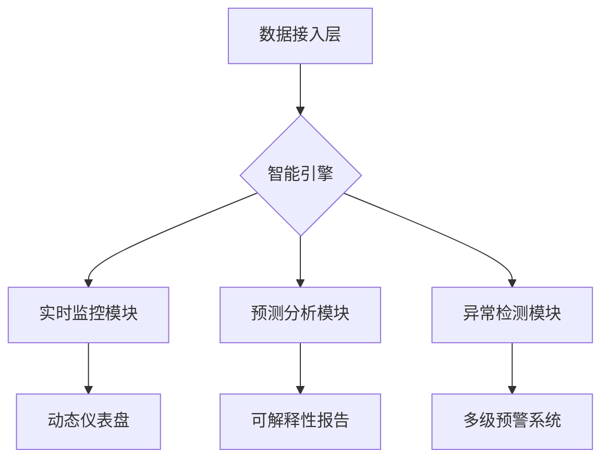

# **开源智能数据分析平台商业计划书**
## **（Open Analytics Platform）**

# 1. 需求分析
## 1.1 核心价值定位
**解决「数据民主化」最后一公里问题**，通过三阶创新突破行业瓶颈：
- **技术平权**：零代码交互 + 智能自动化，降低数据分析门槛
- **部署自由**：全栈式本地化部署方案，满足企业级数据合规需求
- **生态共建**：开源社区驱动产品进化，构建插件市场形成生态闭环

## 1.2. 目标客群
本产品旨在为具备数据分析需求的各类用户提供高效、易用的解决方案，主要目标用户群体按优先级排序如下：
- 企业数据分析师（核心用户）：
    - 典型需求：处理海量业务数据并快速生成定制化报告。
    - 痛点：现有工具如 Excel 处理效率低、无法应对大数据，Tableau 部署复杂且成本高昂。
- 其他潜在用户（后续扩展）：
    - 包括政府政策研究人员、企业财务管理人员、市场营销人员、金融从业者、学术研究人员及个人数据爱好者。这些群体将在产品成熟后逐步支持。

## 1.3. 核心功能
- 实时数据监控：支持用户随时掌握数据变化，可以通过定时任务定期拉取数据，或采用事件驱动机制（如 WebSocket）实现动态更新。
- 数据可视化：提供直观的图表展示，提供多种图表类型（如折线图、热力图、动态仪表盘），支持用户自定义配置。
- 自动生成报告：减少手动操作，提高效率，支持模板化生成（用户可预设格式），并允许导出为 PDF/Word 等格式。
- 智能异常检测和警报：及时提醒用户关键问题，基于规则（如阈值）或机器学习模型检测异常，支持邮件、短信等多渠道警报。
- 预测分析：基于数据提供趋势预测，集成成熟的时间序列模型（如 ARIMA 或 Prophet 模型）或机器学习算法，提供趋势预测。



## 1.4. 产品优势
相较于 Excel、Python、Tableau、Power BI 等工具，构建多维竞争优势：
- 易用性：Tableau的功能复杂度 vs 本产品的零代码设计。
- 低成本：Power BI的订阅成本 vs 开源基础版+增值服务
- 强大的数据处理能力：支持大规模数据和复杂计算，超越 Excel 的局限性。
- 便捷的自动化流程：减少重复性手动操作，提升工作效率。
- 丰富的可视化选项：提供动态交互式图表，弥补传统工具的不足。
- 灵活的部署方式：同时支持本地部署（满足隐私需求）和云端多人协作（提升团队效率）。

## 1.5. 开源与商业化策略
在 GitHub 上以 Apache 2.0 许可证发布，吸引开发者社区参与，代码风格遵循 PEP 8。
- 开源版：提供基础功能（如数据源连接、本地部署、核心可视化工具）。
- 企业版：提供高级功能（如 OAuth/SSO 集成、审计日志、权限管理）。
- 云服务：考虑提供托管服务（如 SaaS 模式），简化用户的部署和维护成本，同时作为商业化收入来源。
- 行业解决方案：
    - 金融风控版（Basel III合规套件）
    - 医疗数据分析版（HIPAA认证工具）

平衡开源与商业化：确保开源版功能足够强大以吸引用户，同时保留企业版的高级功能（如权限管理、高级分析）吸引付费用户。

## 1.2. 市场调研
### 1.2.1. 竞争分析
市场上已有 Tableau、Power BI、Google Data Studio 等类似工具。
- Tableau：
    - 优势：功能强大，支持复杂数据可视化和分析。
    - 劣势：价格高昂，需要专业知识才能熟练使用。
    - 机会：中小企业对低成本、易用工具的需求日益增加。
    - 威胁：开源工具的兴起可能侵蚀其市场份额。
- Power BI：
    - 优势：与Microsoft生态系统深度集成，适合已有Microsoft用户。
    - 劣势：本地部署复杂，学习曲线较陡。
    - 机会：云服务需求增长为其云端功能提供了发展空间。
    - 威胁：低成本或免费替代品可能吸引预算有限的用户。
- Google Data Studio：
    - 优势：免费且易用，适合快速搭建数据报告。
    - 劣势：功能有限，难以满足复杂数据分析需求。
    - 机会：通过扩展高级功能可吸引更多用户。
    - 威胁：用户对数据隐私的担忧可能限制其采用率。
- 本产品差异化：低成本、高自动化、开源+本地部署。

  | 维度         | Open Analytics Platform | Excel         | Tableau         | Power BI         | Google Data Studio |
  |--------------|-------------------------|---------------|-----------------|------------------|--------------------|
  | 易用性       | 零代码设计             | 简单但有限    | 复杂            | 中等复杂         | 简单但功能少       |
  | 成本         | 开源免费 + 增值服务     | 低成本        | 高昂            | 订阅制           | 免费              |
  | 数据处理能力 | 支持大规模数据          | 有限          | 强大            | 强大             | 中等              |
  | 自动化程度   | 高（智能自动化）        | 低            | 中等            | 中等             | 低                |
  | 部署方式     | 本地 + 云协作          | 本地          | 云优先          | 云 + 本地复杂    | 云端              |

### 1.2.2. 用户痛点调研
通过问卷（如 Google Forms）、访谈或 Reddit/知乎等社区讨论。
- 企业数据分析师
    - 痛点：Excel无法处理大数据，自动化程度低；Tableau等工具价格昂贵且操作复杂。
- 市场营销人员
    - 痛点：需要实时监控市场趋势和客户行为，但现有工具缺乏动态警报和直观的可视化选项。
- 其他潜在用户
    - 痛点：工具学习门槛高，部署麻烦，缺乏灵活的本地部署选项。

### 1.2.3. 市场定位
为“中小企业和个人用户的低成本、高效率数据分析工具”，同时支持本地部署和云协作。
- 低成本需求：中小企业和个人用户对价格敏感，希望以低成本获得高效数据分析工具。
- 本地部署需求：部分用户因数据隐私和安全考虑，更倾向于本地部署解决方案。
- 自动化和易用性：用户希望通过自动化流程和直观界面减少手动操作，提高效率。

# 2. 产品需求文档（PRD）
## 2.1. 产品概述
- 产品名称：开源智能数据分析平台（Open Analytics Platform）
- 目标用户：企业数据分析师、市场营销人员（核心用户，后续可扩展至其他群体）。
- 产品定位：低成本、高效率、支持本地部署和云协作的数据分析工具。
- 核心价值：通过自动化和直观的可视化，帮助用户快速处理和分析数据，提升决策效率。
## 2.2. 用户故事
用户故事帮助我们理解用户需求和使用场景：
- 企业数据分析师
    - “作为企业数据分析师，我希望能够一键生成定制化报告，以便快速向管理层汇报业务数据。”
- 市场营销人员
    - “作为市场营销人员，我希望实时监控客户行为数据，并在数据异常时收到警报，以便及时调整营销策略。”
## 2.3. 功能优先级矩阵（MoSCoW法则）
根据用户需求和市场调研，我们将功能需求分为以下优先级：
- Must Have（必须）
    - 数据源连接：支持MySQL、PostgreSQL、CSV等常见数据源，用户可手动上传或通过数据库连接导入数据。
    - 实时数据监控：通过定时任务或WebSocket实现数据动态更新。
    - 基本图表：提供折线图、柱状图、热力图，用户可自定义颜色和样式。
    - 报告自动生成：支持PDF/Word格式导出，提供多种预设模板。
- Should Have（应该）
    - 智能异常检测：基于规则或简单机器学习模型，检测数据异常并通过邮件或界面推送警报。
    - 云协作：支持多人实时协作和数据共享。
- Could Have（可以）
    - 预测分析：集成时间序列模型（如ARIMA）提供趋势预测。
    - 自定义主题：允许用户个性化界面和图表样式。
- Won’t Have（不做）
    - 复杂机器学习模型：初期不集成，待产品成熟后再考虑。
## 2.4. 非功能性需求
- 性能：支持处理10万行数据，响应时间<2秒。
- 安全性：数据传输使用HTTPS加密，存储使用AES加密。
- 合规性：遵守GDPR、CCPA等数据保护法规。
- 可扩展性：模块化设计，便于未来功能扩展。
- 权限管理：提供细粒度的访问控制（如角色权限），保护数据安全。
- 文档与教程：编写详细的用户手册和快速入门教程，支持新用户上手。
- 反馈机制：在产品中集成反馈表单，或在 GitHub 上通过 issue 收集用户建议。

# 3. 技术路线图
技术路线图规划了产品的技术架构和开发阶段，确保技术选型和开发计划与产品需求匹配。
## 3.1. 技术架构
- 模块化设计：将数据接入、处理、可视化等模块分开，便于扩展和新功能开发。
- 通用数据接入层：支持多种数据源（如 SQL 数据库、NoSQL、CSV、API）。使用标准化的连接器（如 JDBC、ODBC）或自定义适配器。PostgreSQL用于元数据存储。
- 云原生架构部署：使用 Docker 容器化部署，便于本地和云端使用。结合 Kubernetes 实现高可用性和弹性扩展。
- 后端：Spring Boot 或 Flask（灵活性高、社区支持强）。
- 前端：ECharts用于数据可视化（易用、社区活跃）。D3.js 或 plotly 或 matplotlib 或 networkx 或 seaborn等备选参考。
- 数据处理：
    - 中小规模数据：Pandas库。
    - 大规模数据：Apache Spark。
## 3.2. 开发计划
开发过程分为多个阶段，确保核心功能优先实现：
- 阶段1（MVP）
    - 目标：快速上线最小可行产品，验证核心功能。
    - 功能：
        - 数据源连接（MySQL、CSV）。
        - 基本图表（折线图、柱状图）。
        - 用户界面：拖拽式配置。
        - 部署：本地Docker部署。
    - 时间：预计2-3个月。
- 阶段2
    - 目标：增强用户体验，增加实用功能。
    - 功能：
        - 实时监控（定时任务和WebSocket）。
        - 报告自动生成（PDF/Word导出）。
        - 云协作（多人实时编辑）。
    - 时间：预计3-4个月。
- 阶段3
    - 目标：扩展高级功能，提升产品竞争力。
    - 功能：
        - 智能异常检测（基于规则的警报）。
        - 预测分析（集成ARIMA模型）。
        - 性能优化（支持更大规模数据）。
    - 时间：预计4-6个月。

# 4. 开发文档
## 4.1. 数据源连接
- 模块化设计：
    - 使用类封装数据加载全过程
    - 每个功能模块独立方法实现
    - 支持文件/数据库/API三种数据源
- 核心功能：
    - 自动类型检测（文件扩展名/内容检测、连接字符串解析）
    - 分块处理大文件（chunk_size参数）
    - 数据库SSL连接支持
    - API认证头支持
    - 元数据自动分析
- 安全措施：
    - 数据库连接使用SSL加密
    - API请求支持Bearer Token认证
    - 输入验证和异常处理
- 扩展性：
    - 可自定义预处理管道
    - 支持多种保存目标（内存/数据库/文件）
    - 灵活的元数据分析框架
- 优化措施：
    - 数据库批量插入
    - 流式处理大文件
    - 异步请求支持（需配合异步库）

# Python 项目代码管理手册

## 引言

随着 Python 项目代码量的增加，管理复杂性随之提升。通过良好的实践和工具，我们可以显著提高代码的可维护性、开发效率和团队协作效果。本手册提供了一系列最佳实践、工具推荐和具体示例，帮助开发者有效管理 Python 项目。内容适用于小型脚本到大型应用的各种场景，特别强调模块化、自动化、规范化和持续改进的原则。

---

## 目录

1. **项目结构规划**  
2. **模块化**  
3. **代码规范**  
4. **版本控制**  
5. **依赖管理和虚拟环境**  
6. **自动化测试**  
7. **工具提升效率**  
8. **配置管理**  
9. **日志管理**  
10. **异常处理**  
11. **文档生成**  
12. **代码复用**  
13. **代码重构与设计模式**  
14. **性能优化**  
15. **团队协作**  
16. **性能监控**  
17. **持续交付**  
18. **安全实践**  
19. **项目模板**  
20. **定期回顾**  

---

## 1. 项目结构规划

合理的项目结构是代码管理的基础。以下是一个推荐的 Python 项目目录结构：

```
project_name/
├── src/                   # 源代码
│   ├── __init__.py
│   ├── core.py           # 核心业务逻辑
│   └── utils/            # 工具函数目录
│       ├── __init__.py
│       └── helpers.py
├── tests/                 # 测试代码
│   ├── __init__.py
│   └── test_core.py      # 核心模块测试
├── docs/                  # 文档
│   └── index.rst
├── scripts/               # 辅助脚本
│   └── deploy.sh
├── notebooks/             # Jupyter Notebooks（可选）
│   └── analysis.ipynb
├── README.md              # 项目说明
├── requirements.txt       # 依赖列表
└── setup.py               # 打包配置
```

- **src/**: 存放源代码，按功能模块化组织。
- **tests/**: 存放单元测试和集成测试。
- **docs/**: 存放项目文档，使用 Sphinx 生成。
- **scripts/**: 存放部署、构建等脚本。
- **notebooks/**: 存放 Jupyter Notebook 文件，适用于数据科学项目。

**最佳实践**:
- 根据项目需求调整结构，例如在数据科学项目中增加 `data/` 目录存放数据集。
- 使用 `__init__.py` 将目录转为包，便于模块导入。

**示例**:
```python
# src/__init__.py
from .core import main_function
```

**资源链接**:
- [Python 官方包管理文档](https://docs.python.org/3/tutorial/modules.html#packages)

---

## 2. 模块化

模块化是管理大型代码库的关键，可提高代码的可读性和可维护性。

- 使用类封装数据加载全过程
- 每个功能模块独立方法实现
- **拆分模块**: 根据功能或职责拆分代码，例如 `io.py` 处理输入输出，`algorithms.py` 定义核心算法。
- **使用包**: 使用目录结构和 `__init__.py` 组织模块。
- **导入优化**: 使用显式导入，避免过多全局变量。
  ```python
  from src.utils.helpers import helper_function
  ```
- **解决循环导入**: 在函数内部延迟导入或重构依赖。
  ```python
  def some_function():
      from . import another_module  # 延迟导入
  ```

**工具推荐**:
- [setuptools](https://setuptools.pypa.io/en/latest/): 用于打包和分发 Python 项目。

**资源链接**:
- [Python 模块化指南](https://realpython.com/python-modules-packages/)

---

## 3. 代码规范

遵循代码规范提高一致性和可读性。

- **PEP 8**: 使用小写下划线命名变量（`my_variable`），缩进 4 个空格，行长不超过 79。
- **文档化**: 为函数、类和模块编写 docstring。
  ```python
  def process_data(data: list) -> dict:
      """处理输入数据并返回结果字典。
      
      Args:
          data: 输入数据列表
      Returns:
          处理后的结果字典
      """
      pass
  ```
- **注释**: 在复杂逻辑处添加简洁注释。

**工具推荐**:
- [flake8](https://flake8.pycqa.org/en/latest/): 检查 PEP 8 合规性。
- [pydocstyle](https://www.pydocstyle.org/en/stable/): 检查 docstring 格式。

**示例**:
```bash
flake8 .
```

**资源链接**:
- [PEP 8 官方文档](https://www.python.org/dev/peps/pep-0008/)

---

## 4. 版本控制

版本控制确保代码变更可追溯，协作顺畅。

- **Git**: 托管代码于 GitHub 或 GitLab，定期提交。
- **提交信息**: 每次提交写明更改，例如“添加用户验证功能”。
- **Git 工作流**: 使用 Git Flow，`main` 为生产分支，`develop` 为开发分支。
- **冲突处理**: 通过 `git rebase` 或手动合并解决。

**最佳实践**:
- 分支命名规范：`feature/xxx`、`bugfix/xxx`。
- 定期清理无用分支。

**工具推荐**:
- [GitHub](https://github.com/): 代码托管平台。
- [GitLab](https://about.gitlab.com/): 提供 CI/CD 功能。

**资源链接**:
- [Git 官方文档](https://git-scm.com/doc)

---

## 5. 依赖管理和虚拟环境

隔离依赖，确保环境一致性。

- **虚拟环境**: 使用 `python -m venv env` 创建。
- **requirements.txt**: 记录依赖：
  ```bash
  pip freeze > requirements.txt
  ```
- **现代工具**: 使用 [Poetry](https://python-poetry.org/) 管理依赖。
- **环境差异**: 区分开发和生产依赖，例如 `requirements-dev.txt`。
- **版本锁定**: Poetry 的 `poetry.lock` 确保一致性。

**示例**:
```bash
poetry add requests
```

**资源链接**:
- [Poetry 官方文档](https://python-poetry.org/docs/)

---

## 6. 自动化测试

自动化测试确保代码质量。

- **单元测试**: 使用 [pytest](https://docs.pytest.org/en/stable/)。
  ```python
  # tests/test_core.py
  def test_add():
      assert add(1, 2) == 3
  ```
- **测试覆盖率**: 使用 [coverage.py](https://coverage.readthedocs.io/en/stable/)。
- **持续集成（CI）**: 使用 GitHub Actions。
  ```yaml
  # .github/workflows/ci.yml
  name: CI
  on: [push]
  jobs:
    test:
      runs-on: ubuntu-latest
      steps:
      - uses: actions/checkout@v2
      - name: Set up Python
        uses: actions/setup-python@v2
        with:
          python-version: '3.8'
      - name: Install dependencies
        run: pip install -r requirements.txt
      - name: Run tests
        run: pytest
  ```
- **TDD**: 先写测试再编码。

**资源链接**:
- [pytest 官方文档](https://docs.pytest.org/en/stable/)

---

## 7. 工具提升效率

工具提高开发效率。

- **IDE**: 推荐 [PyCharm](https://www.jetbrains.com/pycharm/) 或 [VS Code](https://code.visualstudio.com/)。
- **静态分析**: 使用 `flake8` 和 `pylint`。
- **格式化**: 使用 [black](https://black.readthedocs.io/en/stable/)。
  ```bash
  black .
  ```
- **调试**: 使用 `pdb` 或 IDE 调试器。

**资源链接**:
- [black 官方文档](https://black.readthedocs.io/en/stable/)

---

## 8. 配置管理

有效管理配置，确保灵活性和安全性。

- **环境变量**: 使用 [python-dotenv](https://pypi.org/project/python-dotenv/)。
  ```python
  from dotenv import load_dotenv
  load_dotenv()
  ```
- **配置文件**: 使用 `config.py`。
  ```python
  # config.py
  import os
  DEBUG = os.getenv('DEBUG', 'False').lower() == 'true'
  ```
- **多环境**: 使用 `.env.dev` 和 `.env.prod`。

**资源链接**:
- [python-dotenv 文档](https://saurabh-kumar.com/python-dotenv/)

---

## 9. 日志管理

日志便于调试和监控。

- **日志记录**: 使用 `logging` 模块。
  ```python
  import logging
  logging.basicConfig(
      format="%(asctime)s - %(levelname)s - %(name)s - %(message)s",
      level=logging.INFO
  )
  logging.info("程序启动")
  ```
- **工具推荐**: [Loguru](https://loguru.readthedocs.io/en/stable/)。

**资源链接**:
- [Python logging 文档](https://docs.python.org/3/library/logging.html)

---

## 10. 异常处理

合理处理异常提高健壮性。

- **自定义异常**:
  ```python
  class CustomError(Exception):
      pass
  ```
- **异常捕获**:
  ```python
  try:
      result = 1 / 0
  except ZeroDivisionError as e:
      logging.error(f"错误: {e}")
  ```

**最佳实践**:
- 避免捕获过于宽泛的异常。

---

## 11. 文档生成

自动生成文档提高可读性。

- **自动生成**: 使用 [Sphinx](https://www.sphinx-doc.org/en/master/)。
  ```bash
  sphinx-quickstart
  ```
- **README**: 包含安装和使用说明。

**资源链接**:
- [Sphinx 官方文档](https://www.sphinx-doc.org/en/master/)

---

## 12. 代码复用

促进复用，减少重复。

- **公共库**: 抽象通用功能为库。
- **第三方库**: 选择活跃度高的库。

**工具推荐**:
- [PyPI](https://pypi.org/): Python 包索引。

---

## 13. 代码重构与设计模式

重构提高代码质量。

- **单一职责**: 将长函数拆分。
- **设计模式**: 如单例模式。
  ```python
  class Singleton:
      _instance = None
      def __new__(cls):
          if cls._instance is None:
              cls._instance = super().__new__(cls)
          return cls._instance
  ```
- **DRY**: 消除重复代码。

**资源链接**:
- [Refactoring Guru](https://refactoring.guru/)

---

## 14. 性能优化

必要时优化性能。

- **瓶颈分析**: 使用 `cProfile`。
  ```python
  import cProfile
  cProfile.run("my_function()")
  ```
- **缓存**: 使用 `functools.lru_cache`。
  ```python
  @functools.lru_cache(maxsize=128)
  def expensive_function(x):
      pass
  ```

**资源链接**:
- [Python 性能优化指南](https://realpython.com/python-performance-tuning/)

---

## 15. 团队协作

协作对大型项目至关重要。

- **代码审查**: 通过 Pull Request。
- **任务管理**: 使用 Trello 或 Jira。

**最佳实践**:
- 定期代码审查会议。

---

## 16. 性能监控

监控性能，及时发现问题。

- **工具**: 使用 [Prometheus](https://prometheus.io/) 和 [Grafana](https://grafana.com/)。
- **日志分析**: 使用 ELK。

**资源链接**:
- [Prometheus 文档](https://prometheus.io/docs/introduction/overview/)

---

## 17. 持续交付

自动化部署提高效率。

- **Docker**: 用于部署。
- **CI/CD**: 使用 GitHub Actions。
  ```yaml
  # .github/workflows/cd.yml
  name: CD
  on:
    push:
      branches:
        - main
  jobs:
    deploy:
      runs-on: ubuntu-latest
      steps:
      - uses: actions/checkout@v2
      - name: Build and deploy
        run: |
          docker build -t myapp .
          docker push myapp
  ```

**资源链接**:
- [Docker 文档](https://docs.docker.com/)

---

## 18. 安全实践

确保代码安全。

- **依赖安全**: 使用 [safety](https://pypi.org/project/safety/)。
- **漏洞防护**: 避免 SQL 注入。

**工具推荐**:
- [Bandit](https://pypi.org/project/bandit/): 检查安全问题。

---

## 19. 项目模板

模板快速启动项目。

- **工具**: 使用 [cookiecutter](https://cookiecutter.readthedocs.io/en/stable/)。
  ```bash
  cookiecutter https://github.com/audreyr/cookiecutter-pypackage
  ```

**资源链接**:
- [cookiecutter 文档](https://cookiecutter.readthedocs.io/en/stable/)

---

## 20. 定期回顾

定期改进项目。

- **代码回顾**: 分享最佳实践。
- **技术债务**: 使用 [SonarQube](https://www.sonarqube.org/) 分析。

**最佳实践**:
- 每季度回顾一次。

---

## 实际案例

以下是一个应用本手册的小型项目示例：
- **项目名称**: [python-project-template](https://github.com/username/python-project-template)
- **描述**: 一个遵循本手册建议的 Python 项目模板，包含推荐的目录结构、工具配置和示例代码。

---

## 结语

本手册为 Python 开发者提供全面的代码管理指南。通过遵循这些实践和工具，开发者可以有效管理不同规模的项目，提高代码质量和协作效率。手册将持续更新以适应 Python 生态的最新发展。
