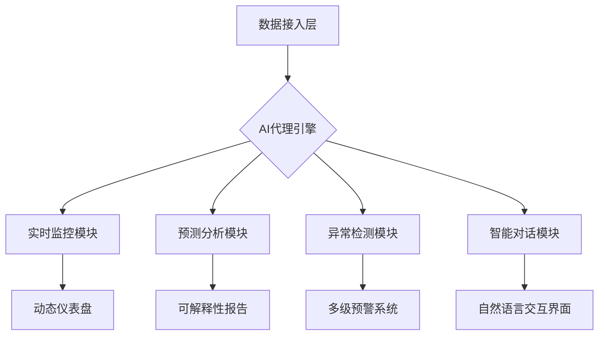

# **开源智能数据分析平台商业计划书**
## **（Open Analytics Platform）**

# 1. 需求分析

## 1.1 核心价值定位
本产品旨在**解决“数据民主化”最后一公里问题**，通过AI技术特别是AI代理的创新应用，突破传统数据分析工具的局限性，提供以下三阶价值：
- **技术平权**：零代码交互界面结合AI代理驱动的智能自动化，显著降低数据分析门槛。
- **部署自由**：全栈式本地化部署方案，满足企业对数据隐私和合规性的需求。
- **生态共建**：通过开源社区推动产品进化，构建插件市场形成生态闭环。

随着AI代理市场的快速增长，企业对智能化的需求已从被动响应转向主动决策和任务执行。本产品通过AI代理的整合，助力企业在效率和竞争力上实现质的飞跃。

## 1.2. 目标客群
本产品面向具备数据分析和智能化需求的各类用户，主要目标客群按优先级排序如下：
- 企业数据分析师（核心用户）：
    - 典型需求：处理海量业务数据并快速生成定制化报告。
    - 痛点：现有工具如 Excel 处理效率低、无法应对大数据，Tableau 部署复杂且成本高昂。
- 其他潜在用户（后续扩展）：
    - 包括政府政策研究人员、企业财务管理人员、市场营销人员、金融从业者、学术研究人员及个人数据爱好者。这些群体将在产品成熟后逐步支持。

这些用户群体对AI代理的自动化、智能对话和数据驱动决策能力有强烈需求，产品将优先满足核心用户需求并逐步扩展。

## 1.3. 核心功能
产品以AI代理为核心，围绕其三大能力（自动化任务执行、智能对话系统、数据驱动决策）设计以下功能：
- **AI代理驱动的智能分析**：自主拆解任务、智能分配并执行数据分析流程。
- **实时数据监控**：支持定时任务和事件驱动机制（WebSocket），动态更新数据。
- **数据可视化**：提供多种图表类型（如折线图、热力图），支持自定义配置和交互。
- **自动生成报告**：基于模板化设计，支持多种导出格式（PDF/Word），由AI代理优化内容。
- **智能异常检测和警报**：AI代理基于实时数据分析，及时提醒用户关键问题，基于规则（如阈值）或机器学习模型检测异常，支持邮件、短信等多渠道警报。
- **预测分析**：基于数据提供趋势预测，集成成熟的时间序列模型（如 ARIMA 或 Prophet 模型）或机器学习算法，提供趋势预测。
- **智能对话系统**：支持自然语言交互，用户可通过对话与AI代理完成数据查询和分析。



## 1.4. 产品优势
相较于传统工具（如Excel、Tableau、Power BI）和新兴AI代理产品，本产品具备以下竞争优势：
- **易用性**：AI代理辅助的零代码设计，操作门槛远低于Tableau等工具。
- **低成本**：开源基础版结合增值服务，性价比优于Power BI的订阅制。
- **强大的数据处理能力**：支持大规模数据和复杂计算，超越Excel局限。
- **高度自动化**：AI代理驱动的任务执行，减少人工干预。
- **智能对话**：自然语言交互提升用户体验，弥补传统工具不足。
- **灵活部署**：本地部署与云协作并存，满足多样化需求。
- **差异化定位**：相较于OpenAI Assistants API等纯AI产品，提供更低的部署成本和更高的定制性。

## 1.5. 开源与商业化策略
产品在GitHub上以Apache 2.0许可证发布，吸引开发者社区参与，同时通过商业化实现可持续发展：
- **开源版**：提供基础功能，如数据源连接、本地部署、核心可视化工具。
- **企业版**：提供高级功能，如AI代理高级配置、OAuth/SSO集成、审计日志、权限管理。
- **云服务**：推出SaaS模式托管服务，简化部署并作为主要收入来源。
- **行业解决方案**：针对金融风控（Basel III合规）、医疗数据分析（HIPAA认证）等场景定制版本。

平衡开源与商业化：确保开源版功能足够强大以吸引用户，同时保留企业版的高级功能（如权限管理、高级分析）吸引付费用户。通过开源吸引用户，借助AI代理的高级功能推动企业版和云服务的付费转化。

## 1.2. 市场调研
### 1.2.1. 竞争分析
市场上主要竞争对手包括传统数据分析工具和新兴AI代理产品：
- **Tableau**：
    - 优势：功能强大，支持复杂数据可视化和分析。
    - 劣势：价格高昂，需要专业知识才能熟练使用，缺乏AI代理的自动化和对话能力。
    - 机会：中小企业对低成本、易用工具的需求日益增加。
    - 威胁：开源工具的兴起可能侵蚀其市场份额。
- **Power BI**：
    - 优势：与Microsoft生态系统深度集成，适合已有Microsoft用户。
    - 劣势：AI功能有限，本地部署复杂，学习曲线较陡。
    - 机会：云服务需求增长为其云端功能提供了发展空间。
    - 威胁：低成本或免费替代品可能吸引预算有限的用户。
- **Google Data Studio**：
    - 优势：免费且易用，适合快速搭建数据报告。
    - 劣势：功能有限，难以满足复杂数据分析需求，无AI代理支持。
    - 机会：通过扩展高级功能可吸引更多用户。
    - 威胁：用户对数据隐私的担忧可能限制其采用率。
- **AI代理产品（如OpenAI Assistants API）**：
  - 优势：强大的AI能力，支持任务自动化。
  - 劣势：集成复杂，成本高昂。
- **本产品差异化**：低成本、高自动化、AI代理驱动、开源+本地部署。

| 维度         | Open Analytics Platform | Excel       | Tableau       | Power BI       | Google Data Studio | AI代理产品 |
|--------------|-------------------------|-------------|---------------|----------------|--------------------|------------|
| 易用性       | AI代理辅助零代码设计    | 简单但有限  | 复杂          | 中等复杂       | 简单但功能少       | 复杂       |
| 成本         | 开源免费+增值服务       | 低成本      | 高昂          | 订阅制         | 免费              | 高昂       |
| 数据处理能力 | 支持大规模数据          | 有限        | 强大          | 强大           | 中等              | 视具体产品 |
| 自动化程度   | 高（AI代理驱动）        | 低          | 中等          | 中等           | 低                | 高         |
| 部署方式     | 本地+云协作            | 本地        | 云优先        | 云+本地复杂    | 云端              | 云端       |
| AI能力       | 强大（AI代理）          | 无          | 有限          | 有限           | 无                | 强大       |

### 1.2.2. 用户痛点调研
通过问卷（如 Google Forms）、访谈或 Reddit/知乎等社区讨论。
- **企业数据分析师**：传统工具效率低，缺乏AI辅助和自动化。
- **运营管理人员**：需实时监控和自动执行任务，现有工具支持不足。
- **市场营销人员**：希望通过AI代理获取客户行为洞察并优化策略。
- **财务管理人员**：需要数据驱动的决策支持和自动化报告。
- **其他潜在用户**：
    - 痛点：工具学习门槛高，部署麻烦，缺乏灵活的本地部署选项。

### 1.2.3. 市场定位
定位为**中小企业和个人用户的低成本、高效率、AI驱动的数据分析工具**，强调AI代理带来的智能化优势，同时支持本地部署和云协作，满足隐私和灵活性需求。

# 2. 产品需求文档（PRD）

## 2.1 产品概述
- **产品名称**：开源智能数据分析平台（Open Analytics Platform）
- **目标用户**：企业数据分析师、运营管理人员、市场营销人员、财务管理人员等。
- **产品定位**：低成本、高效率、AI驱动、支持本地部署和云协作的数据分析工具。
- **核心价值**：通过AI代理实现任务自动化、智能对话和数据驱动决策，提升企业智能化水平。

## 2.2. 用户故事
- **企业数据分析师**：“作为数据分析师，我希望AI代理自动分析数据并生成报告，以便快速向管理层汇报。”
- **运营管理人员**：“作为运营管理人员，我希望AI代理实时监控数据并在异常时自动执行任务，提升效率。”
- **市场营销人员**：“作为市场营销人员，我希望通过智能对话与AI代理交互，获取客户行为洞察并优化策略。”

## 2.3. 功能优先级矩阵（MoSCoW法则）
根据用户需求和市场调研，我们将功能需求分为以下优先级：
- **Must Have（必须）**
    - AI代理基础功能（任务拆解、执行、对话）
    - 数据源连接：支持MySQL、PostgreSQL、CSV等常见数据源，用户可手动上传或通过数据库连接导入数据。
    - 实时数据监控：通过定时任务或WebSocket实现数据动态更新。
    - 基本图表：提供折线图、柱状图、热力图，用户可自定义颜色和样式。
    - 报告自动生成：支持PDF/Word格式导出，提供多种预设模板。
- **Should Have（应该）**
    - 智能异常检测：基于规则或简单机器学习模型，检测数据异常并通过邮件或界面推送警报。
    - 云协作：支持多人实时协作和数据共享。
- **Could Have（可以）**
    - 预测分析：集成时间序列模型（如ARIMA）提供趋势预测。
    - 自定义主题：允许用户个性化界面和图表样式。
    - 高级AI代理功能（多代理协作）
- **Won’t Have（不做）**
    - 复杂机器学习模型：初期不集成，待产品成熟后再考虑。

## 2.4. 非功能性需求
- **性能**：支持处理10万行数据，响应时间<2秒。
- **安全性**：数据传输使用HTTPS加密，存储使用AES加密。
- **合规性**：遵守GDPR、CCPA等数据保护法规。
- **可扩展性**：模块化设计，便于未来功能扩展。
- **权限管理**：提供细粒度的访问控制（如角色权限），保护数据安全。
- **文档与教程**：编写详细的用户手册和快速入门教程，支持新用户上手。
- **反馈机制**：在产品中集成反馈表单，或在 GitHub 上通过 issue 收集用户建议。

# 3. 技术路线图
技术路线图规划了产品的技术架构和开发阶段，确保技术选型和开发计划与产品需求匹配。

## 3.1. 技术架构
- **AI代理引擎**：支持大型语言模型（LLM）和多模态感知。
- **模块化设计**：数据接入、AI代理、数据处理、可视化模块独立开发。
- **通用数据接入层**：支持多种数据源（如 SQL 数据库、NoSQL、CSV、API）。使用标准化的连接器（如 JDBC、ODBC）或自定义适配器。PostgreSQL用于元数据存储。
- **云原生架构部署**：使用 Docker 容器化部署，便于本地和云端使用。结合 Kubernetes 实现高可用性和弹性扩展。
- **后端**：Spring Boot 或 Flask（灵活性高、社区支持强）。
- **前端**：ECharts用于数据可视化（易用、社区活跃）。D3.js 或 plotly 或 matplotlib 或 networkx 或 seaborn等备选参考。
- **数据处理**：
    - 中小规模数据：Pandas库。
    - 大规模数据：Apache Spark。

## 3.2. 开发计划
开发过程分为多个阶段，确保核心功能优先实现：
- 阶段1（MVP）
    - 目标：快速上线最小可行产品，验证核心功能。
    - 功能：
        - AI代理基础功能
        - 数据源连接（MySQL、CSV）。
        - 基本图表（折线图、柱状图）。
        - 用户界面：拖拽式配置。
        - 部署：本地Docker部署。
    - 时间：预计2-3个月。
- 阶段2
    - 目标：增强用户体验，增加实用功能。
    - 功能：
        - 实时监控（定时任务和WebSocket）。
        - 报告自动生成（PDF/Word导出）。
        - 云协作（多人实时编辑）。
    - 时间：预计3-4个月。
- 阶段3
    - 目标：扩展高级功能，提升产品竞争力。
    - 功能：
        - 智能异常检测（基于规则的警报）。
        - 预测分析（集成ARIMA模型）。
        - 性能优化（支持更大规模数据）。
    - 时间：预计4-6个月。

# Python 项目代码管理手册

## 引言

本手册旨在为**开源智能数据分析平台（Open Analytics Platform）**的开发提供全面的代码管理指导，确保团队在开发过程中遵循最佳实践，提高代码质量、开发效率和协作效果。手册内容特别针对产品的核心需求——AI代理驱动的智能分析、数据处理与可视化、本地部署与云协作，以及开源生态建设——进行了定制化设计，适用于从MVP到成熟产品的各个开发阶段。

---

## 目录

1. **项目结构规划**  
2. **模块化**  
3. **代码规范**  
4. **版本控制**  
5. **依赖管理和虚拟环境**  
6. **自动化测试**  
7. **工具提升效率**  
8. **配置管理**  
9. **日志管理**  
10. **异常处理**  
11. **文档生成**  
12. **代码复用**  
13. **代码重构与设计模式**  
14. **性能优化**  
15. **团队协作**  
16. **安全实践**  
17. **持续集成与持续部署（CI/CD）**  
18. **项目模板**  
19. **定期回顾**

---

## 1. 项目结构规划

合理的项目结构是代码管理的基础。以下是一个推荐的 Python 项目目录结构：

```
open_analytics_platform/
├── src/                   # 源代码
│   ├── __init__.py
│   ├── ai_agents/         # AI代理引擎
│   │   ├── __init__.py
│   │   └── agent_core.py
│   ├── data_access/       # 数据接入层
│   │   ├── __init__.py
│   │   └── connectors.py
│   ├── data_processing/   # 数据处理模块
│   │   ├── __init__.py
│   │   └── processors.py
│   ├── visualization/     # 可视化模块
│   │   ├── __init__.py
│   │   └── charts.py
│   └── utils/             # 工具函数目录
│       ├── __init__.py
│       └── helpers.py
├── tests/                 # 测试代码
│   ├── __init__.py
│   ├── test_ai_agents.py
│   ├── test_data_access.py
│   ├── test_data_processing.py
│   └── test_visualization.py
├── docs/                  # 文档
│   └── index.rst
├── scripts/               # 辅助脚本
│   └── deploy.sh
├── notebooks/             # Jupyter Notebooks（可选）
│   └── analysis.ipynb
├── Dockerfile             # Docker配置文件
├── README.md              # 项目说明
├── requirements.txt       # 依赖列表
└── setup.py               # 打包配置
```

- **src/**: 按功能模块化组织源代码，包括`ai_agents/`（AI代理引擎）、`data_access/`（数据接入）、`data_processing/`（数据处理）、`visualization/`（可视化）。
- **tests/**: 存放单元测试和集成测试。
- **docs/**: 使用Sphinx生成项目文档，支持开源社区参与。
- **scripts/**: 存放部署脚本，支持本地和云部署。
- **notebooks/**: 用于数据分析原型开发。
- **Dockerfile**: 支持容器化部署。

**最佳实践**:
- 根据技术栈调整结构，例如在`data_processing/`中集成Pandas或Apache Spark。
- 使用`__init__.py`将目录转为包，便于模块导入。

**示例**:
```python
# src/__init__.py
from .ai_agents.agent_core import AIAgent
from .data_access.connectors import DataConnector
```

**资源链接**:
- [Python 官方包管理文档](https://docs.python.org/3/tutorial/modules.html#packages)

---

## 2. 模块化

模块化设计是产品技术架构的核心，可提高代码可维护性和扩展性。

- **拆分模块**: 根据职责拆分，例如`ai_agents/`处理任务拆解和执行，`data_access/`支持MySQL、CSV等数据源。
- **松耦合**: 确保模块间通过明确接口交互，例如数据处理模块与可视化模块独立运行。
- **导入优化**: 使用显式导入：
  ```python
  from src.utils.helpers import log_activity
  ```
- **解决循环导入**: 在函数内延迟导入：
  ```python
  def process_task():
      from .data_processing import DataProcessor
  ```

**工具推荐**:
- [setuptools](https://setuptools.pypa.io/en/latest/): 用于打包模块，支持开源发布。

**资源链接**:
- [Python 模块化指南](https://realpython.com/python-modules-packages/)

---

## 3. 代码规范

一致的代码规范便于团队协作和社区贡献。

- **PEP 8**: 使用小写下划线命名变量（`my_variable`），缩进 4 个空格，行长不超过 79。
- **文档化**: 为函数、类和模块编写 docstring。
  ```python
  def process_data(data: list) -> dict:
      """处理输入数据并返回结果字典。
      
      Args:
          data: 输入数据列表
      Returns:
          处理后的结果字典
      """
      pass
  ```
- **注释**: 在复杂逻辑处添加简洁注释。

**工具推荐**:
- [flake8](https://flake8.pycqa.org/en/latest/): 检查 PEP 8 合规性。
- [pydocstyle](https://www.pydocstyle.org/en/stable/): 检查 docstring 格式。

**示例**:
```bash
flake8 .
```

**资源链接**:
- [PEP 8 官方文档](https://www.python.org/dev/peps/pep-0008/)

---

## 4. 版本控制

版本控制确保代码变更可追溯，协作顺畅。

- **Git**: 使用GitHub托管代码，支持Apache 2.0许可。
- **提交信息**: 清晰描述变更，例如“feat: 添加AI代理任务拆解功能”。
- **分支策略**: 使用Git Flow，`main`为稳定版，`develop`为开发版。
- **代码审查**: 通过Pull Request确保代码质量。

**最佳实践**:
- 分支命名：`feature/ai-agent`、`bugfix/data-access`。
- 为开源社区提供清晰的CONTRIBUTING.md。

**工具推荐**:
- [GitHub Actions](https://github.com/features/actions): 自动化测试和部署。

**资源链接**:
- [Git 官方文档](https://git-scm.com/doc)

---

## 5. 依赖管理和虚拟环境

依赖管理确保环境一致性，支持本地和云部署。

- **虚拟环境**: 使用`python -m venv env`。
- **依赖记录**: 使用`requirements.txt`：
  ```bash
  pip freeze > requirements.txt
  ```
- **现代工具**: 推荐[Poetry](https://python-poetry.org/)管理依赖：
  ```bash
  poetry add pandas apache-spark
  ```
- **环境区分**: 使用`requirements-dev.txt`记录开发依赖。

**最佳实践**:
- 锁定版本以确保一致性。

**资源链接**:
- [Poetry 官方文档](https://python-poetry.org/docs/)

---

## 6. 自动化测试

自动化测试确保代码质量。

- **单元测试**: 使用 [pytest](https://docs.pytest.org/en/stable/)。
  ```python
  # tests/test_core.py
  def test_add():
      assert add(1, 2) == 3
  ```
  ```python
  # tests/test_ai_agents.py
  def test_task_decomposition():
      agent = AIAgent()
      tasks = agent.decompose_task("analyze sales data")
      assert len(tasks) > 0
  ```
- **集成测试**: 测试数据接入与AI代理的协作。
- **覆盖率**: 使用[coverage.py](https://coverage.readthedocs.io/en/stable/)：
  ```bash
  coverage run -m pytest
  ```
- **持续集成（CI）**: 使用 GitHub Actions。
  ```yaml
  # .github/workflows/ci.yml
  name: CI
  on: [push]
  jobs:
    test:
      runs-on: ubuntu-latest
      steps:
      - uses: actions/checkout@v2
      - name: Set up Python
        uses: actions/setup-python@v2
        with:
          python-version: '3.8'
      - name: Install dependencies
        run: pip install -r requirements.txt
      - name: Run tests
        run: pytest
  ```
- **TDD**: 先写测试再编码。

**最佳实践**:
- 针对AI代理的复杂逻辑编写端到端测试。

**资源链接**:
- [pytest 官方文档](https://docs.pytest.org/en/stable/)

---

## 7. 工具提升效率

工具提高开发效率。

- **IDE**: 推荐[VS Code](https://code.visualstudio.com/)（轻量，支持Jupyter）或[PyCharm](https://www.jetbrains.com/pycharm/)。
- **静态分析**: 使用 `flake8` 和 `pylint`。
- **格式化**: 使用 [black](https://black.readthedocs.io/en/stable/)。
  ```bash
  black .
  ```
- **调试**: 使用 `pdb` 或 IDE 调试器。

**示例**:
```bash
pylint src/
```

**资源链接**:
- [black 官方文档](https://black.readthedocs.io/en/stable/)
- [VS Code Python 扩展](https://code.visualstudio.com/docs/languages/python)

---

## 8. 配置管理

有效管理配置，确保灵活性和安全性。

- **环境变量**: 使用 [python-dotenv](https://pypi.org/project/python-dotenv/)。
  ```python
  from dotenv import load_dotenv
  load_dotenv()
  DATABASE_URL = os.getenv("DATABASE_URL")
  ```
- **配置文件**: 使用 `config.py`。
  ```python
  # config.py
  import os
  DEBUG = os.getenv('DEBUG', 'False').lower() == 'true'
  ```
- **多环境**: 使用 `.env.dev` 和 `.env.prod`。

**最佳实践**:
- 将敏感信息（如API密钥）存储在环境变量中。

**资源链接**:
- [python-dotenv 文档](https://saurabh-kumar.com/python-dotenv/)

---

## 9. 日志管理

日志便于调试和监控。

- **日志记录**: 使用 `logging` 模块。
  ```python
  import logging
  logging.basicConfig(
      format="%(asctime)s - %(levelname)s - %(name)s - %(message)s",
      level=logging.INFO
  )
  logging.info("程序启动")
  ```
- **结构化日志**: 使用[Loguru](https://loguru.readthedocs.io/en/stable/)：
  ```python
  from loguru import logger
  logger.info("AI代理执行任务: {task}", task="data_analysis")
  ```
- **工具推荐**: [Loguru](https://loguru.readthedocs.io/en/stable/)。

**最佳实践**:
- 为AI代理和数据处理模块记录关键事件。

**资源链接**:
- [Python logging 文档](https://docs.python.org/3/library/logging.html)
- [Loguru 文档](https://loguru.readthedocs.io/en/stable/)

---

## 10. 异常处理

合理处理异常提高健壮性。

- **自定义异常**:
  ```python
  class CustomError(Exception):
      pass
  ```
  ```python
  class AIAgentError(Exception):
      pass
  ```
- **异常捕获**:
  ```python
  try:
      result = 1 / 0
  except ZeroDivisionError as e:
      logging.error(f"错误: {e}")
  ```
  ```python
  try:
      agent.execute_task("analyze")
  except AIAgentError as e:
      logger.error(f"任务执行失败: {e}")
  ```

**最佳实践**:
- 避免捕获过于宽泛的异常。
- 为AI代理的关键任务提供回退机制。

---

## 11. 文档生成

自动生成文档提高可读性，文档支持开源社区参与。

- **自动化**: 使用[Sphinx](https://www.sphinx-doc.org/en/master/)：
  ```bash
  sphinx-quickstart
  ```
- **内容**: 包括API文档、安装指南和用户教程。

**资源链接**:
- [Sphinx 官方文档](https://www.sphinx-doc.org/en/master/)

---

## 12. 代码复用

促进复用，减少重复。

- **公共库**: 抽象通用功能为库。
- **第三方库**: 选择活跃度高的库。
- **公共模块**: 将工具函数放入`utils/`。
- **包发布**: 使用`setup.py`发布到PyPI。

**工具推荐**:
- [PyPI](https://pypi.org/): Python 包索引。
- [twine](https://twine.readthedocs.io/en/stable/): 上传包。

---

## 13. 代码重构与设计模式

重构提高代码质量，支持长期维护。

- **单一职责**: 将长函数拆分。
- **设计模式**: 使用工厂模式创建AI代理：
  ```python
  class AgentFactory:
      @staticmethod
      def create_agent(type_):
          if type_ == "analysis":
              return AnalysisAgent()
  ```
- **设计模式**: 如单例模式。
  ```python
  class Singleton:
      _instance = None
      def __new__(cls):
          if cls._instance is None:
              cls._instance = super().__new__(cls)
          return cls._instance
  ```
- **DRY**: 消除重复代码。

**资源链接**:
- [Refactoring Guru](https://refactoring.guru/)

---

## 14. 性能优化

必要时优化性能。

- **瓶颈分析**: 使用 `cProfile`。
  ```python
  import cProfile
  cProfile.run("my_function()")
  ```
- **缓存**: 使用 `functools.lru_cache`。
  ```python
  @functools.lru_cache(maxsize=128)
  def expensive_function(x):
      pass
  ```
  
**最佳实践**:
- 为Apache Spark任务优化内存分配。


**资源链接**:
- [Python 性能优化指南](https://realpython.com/python-performance-tuning/)

---

## 15. 团队协作

协作对大型项目至关重要。

- **代码审查**: 使用GitHub Pull Requests。
- **任务管理**: 使用 Trello 或 Jira，或使用[GitHub Projects](https://github.com/features/projects)。

**最佳实践**:
- 定期代码审查会议。
- 定期举办社区技术分享。

---

## 16. 性能监控

监控性能，及时发现问题。

- **加密**: 使用HTTPS和AES。
- **依赖扫描**: 使用[safety](https://pypi.org/project/safety/)：
  ```bash
  safety check
  ```
- **漏洞防护**: 避免 SQL 注入。
- **工具**: 使用 [Prometheus](https://prometheus.io/) 和 [Grafana](https://grafana.com/)。
- **日志分析**: 使用 ELK。

**资源链接**:
- [Prometheus 文档](https://prometheus.io/docs/introduction/overview/)
- [Bandit 文档](https://pypi.org/project/bandit/)

---

## 17. 持续集成与持续部署（CI/CD）

自动化部署提高效率。

- **Docker**: 用于部署。
- **CI/CD**: 使用 GitHub Actions。
  ```yaml
  # .github/workflows/cd.yml
  name: CD
  on:
    push:
      branches:
        - main
  jobs:
    deploy:
      runs-on: ubuntu-latest
      steps:
      - uses: actions/checkout@v2
      - name: Build and deploy
        run: |
          docker build -t myapp .
          docker push myapp
  ```
  ```yaml
  name: CI/CD
  on: [push]
  jobs:
    test-and-deploy:
      runs-on: ubuntu-latest
      steps:
      - uses: actions/checkout@v2
      - name: Test
        run: pytest
      - name: Build Docker
        if: github.ref == 'refs/heads/main'
        run: |
          docker build -t open-analytics .
          docker push open-analytics
  ```

**资源链接**:
- [Docker 文档](https://docs.docker.com/)

---

## 18. 项目模板

模板快速启动项目。

- **工具**: 使用 [cookiecutter](https://cookiecutter.readthedocs.io/en/stable/)。
  ```bash
  cookiecutter https://github.com/audreyr/cookiecutter-pypackage
  ```

**资源链接**:
- [cookiecutter 文档](https://cookiecutter.readthedocs.io/en/stable/)

---

## 19. 定期回顾

定期改进项目。

- **代码回顾**: 分享最佳实践。
- **技术债务**: 使用 [SonarQube](https://www.sonarqube.org/) 分析。
- **频率**: 每季度回顾。

**最佳实践**:
- 每季度回顾一次。

---

## 实际案例

以下是一个应用本手册的小型项目示例：
- **项目名称**: [python-project-template](https://github.com/username/python-project-template)
- **描述**: 一个遵循本手册建议的 Python 项目模板，包含推荐的目录结构、工具配置和示例代码。

---

## 结语

本手册为**开源智能数据分析平台**的开发提供了定制化的代码管理指南，涵盖了AI代理驱动的开发需求、技术栈支持、开源协作和部署灵活性。通过遵循这些实践，团队可高效构建一个高质量、可扩展的智能数据分析平台。
